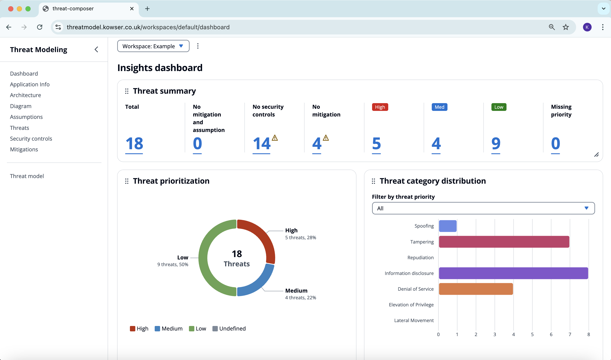
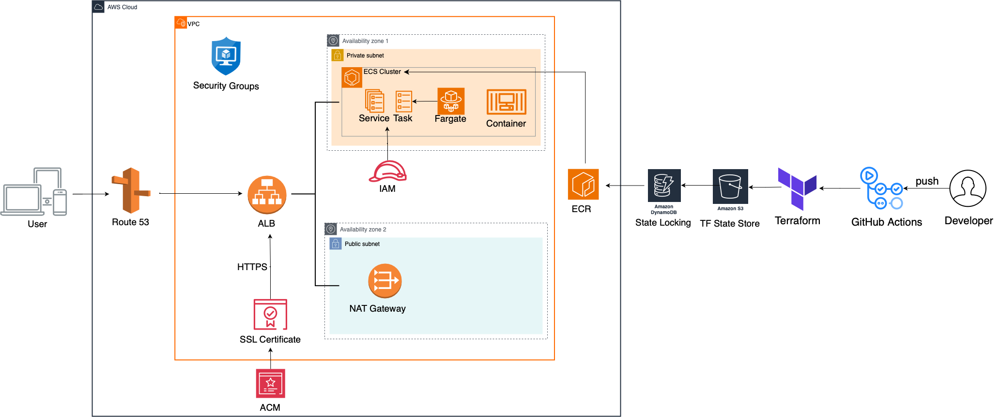

# E2E Deployment– Threat Composer App 🚀

A containerised deployment of Amazon's open-source Threat Composer tool for threat modeling and security assessments, deployed on AWS ECS using Terraform and automated with GitHub Actions.

## 📸 Application Dashboard:



## 📋 Overview
This project demonstrates a complete CI/CD pipeline and cloud deployment strategy for the Threat Composer application, featuring:

- Containerisation: Docker image with optimised build process
- Container Registry: AWS Elastic Container Registry
- Orchestration: AWS Elastic Container Service
- Infrastructure: Terraform modules for reproducible deployments
- Security: HTTPS-enabled with proper SSL/TLS configuration
- CI/CD: Automated build, test, and deployment pipeline

## 🏗️ Architecture Infrastructure 



## 🔑 Key Components

- **Application Load Balancer** – HTTPS termination and traffic routing  
- **ECS Cluster** – Container orchestration  
- **ECS Service** – Application deployment and scaling  
- **ECR Repository** – Container image storage  
- **VPC & Networking** – Secure network configuration  
- **IAM Roles** – Least privilege access control  

## 🛠️ Technology Stack

| Category            | Tool/Service                        |
|---------------------|-------------------------------------|
| **Frontend**        | React.js (Threat Composer UI)       |
| **Containerisation**| Docker                              |
| **Container Registry** | AWS ECR                          |
| **Orchestration**   | AWS ECS                             |
| **Infrastructure**  | Terraform                           |
| **Load Balancing**  | AWS Application Load Balancer       |
| **SSL/TLS**         | AWS Certificate Manager             |
| **CI/CD**           | GitHub Actions                      |

## Deploy infrastructure

The automated pipeline handles:

Build - Container image creation  
Test - Application testing and security scanning  
Push - Image deployment to ECR  
Deploy - Provisions AWS infrastructure

## Local app setup 💻

```bash
yarn install
yarn build
yarn global add serve
serve -s build

#yarn start
http://localhost:3000/workspaces/default/dashboard

## or
yarn global add serve
serve -s build
```

🤝 Contributing

Fork the repository  
Create a feature branch  
Make your changes  
Submit a pull request
